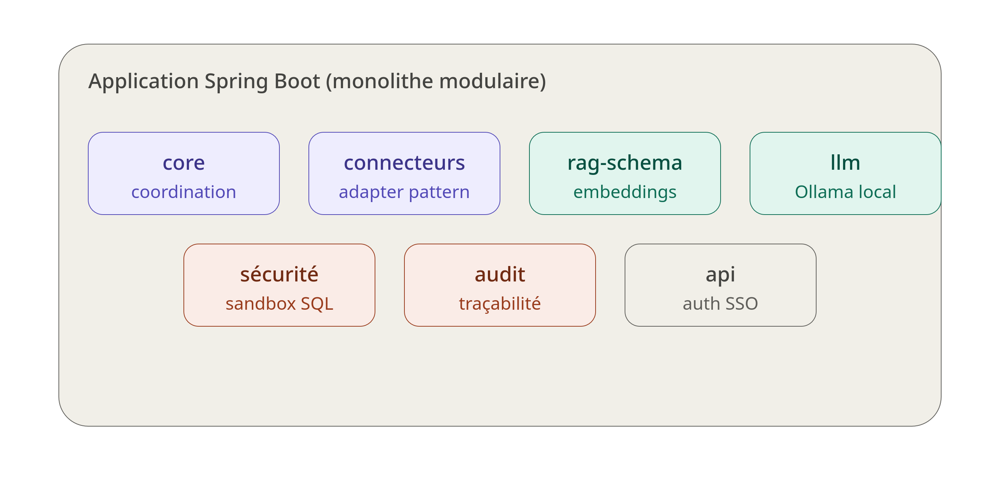
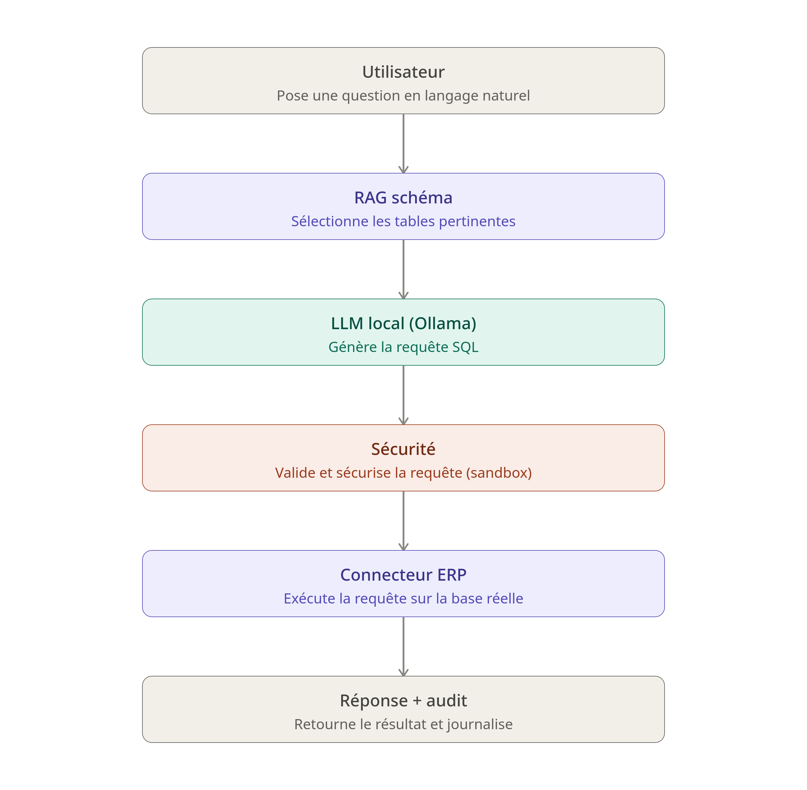

# ERPilot — Assistant SQL local pour ERP (Text-to-SQL + RAG)

Assistant intelligent qui permet d'interroger n'importe quelle base de données ERP en langage naturel, sans que la moindre donnée ne quitte l'entreprise. Le système se connecte automatiquement à une base ERP, comprend sa structure, puis traduit les questions des utilisateurs en requêtes SQL sécurisées, exécutées et journalisées.

## Sommaire

- [Présentation](#présentation)
- [Architecture](#architecture)
- [Flux de traitement d'une question](#flux-de-traitement-dune-question)
- [Stack technique](#stack-technique)
- [Concepts clés](#concepts-clés)
- [Prérequis](#prérequis)
- [Installation](#installation)
- [Utilisation](#utilisation)
- [Sécurité](#sécurité)
- [Structure du projet](#structure-du-projet)
- [Roadmap](#roadmap)

## Présentation

ERPilot est une application **on-premise** qui permet à un utilisateur métier de poser une question en français (ex : *"combien de produits sont en rupture de stock ?"*) et d'obtenir une réponse basée sur les données réelles de son ERP, sans écrire de SQL et sans envoyer de données à un service cloud externe.

Le système repose sur trois piliers :

1. **Généricité** — via une introspection automatique du schéma de la base (JDBC), ERPilot s'adapte à n'importe quel ERP sans configuration manuelle des tables.
2. **Confidentialité** — le LLM (Ollama) tourne en local ; aucune donnée ne sort de l'infrastructure de l'entreprise.
3. **Sécurité** — chaque requête générée par le LLM passe par un validateur (sandbox SQL) avant exécution, avec gestion des permissions par rôle et journalisation complète.

## Architecture

L'application est un **monolithe modulaire** développé en Spring Boot, organisé en packages indépendants selon leur responsabilité (core, connecteurs, RAG, LLM, sécurité, audit, API).

<!-- 📌 Emplacement 1 : schéma des modules de l'application -->


## Flux de traitement d'une question

Une question posée par l'utilisateur traverse successivement le RAG (sélection des tables pertinentes), le LLM local (génération du SQL), le module de sécurité (validation et sandbox), le connecteur ERP (exécution), puis retourne une réponse journalisée.

<!-- 📌 Emplacement 2 : schéma du flux de traitement -->


## Stack technique

| Composant | Technologie |
|---|---|
| Backend | Java 21, Spring Boot 3.x |
| IA / LLM | Ollama (Llama 3.1) en local, via Spring AI |
| Embeddings | nomic-embed-text |
| Base de données | PostgreSQL + extension pgvector |
| Validation SQL | JSqlParser |
| Connexion ERP | JDBC (introspection automatique du schéma) |
| Conteneurisation | Docker / Docker Compose |

## Concepts clés

- **RAG (Retrieval-Augmented Generation)** : avant de générer du SQL, le système recherche les tables/colonnes les plus pertinentes par similarité vectorielle, plutôt que de fournir tout le schéma au LLM.
- **Text-to-SQL** : transformation d'une question en langage naturel en requête SQL exécutable, guidée par le contexte RAG.
- **Sandbox SQL** : toute requête générée est analysée avant exécution — uniquement des `SELECT`, tables autorisées, `LIMIT` automatique.
- **RLS / permissions par rôle** : chaque utilisateur ne peut interroger que les tables associées à son rôle.
- **Masking** : les données sensibles (emails, montants, numéros) sont anonymisées avant d'être affichées.
- **Audit log** : chaque question, requête SQL générée, et résultat est journalisé pour la traçabilité.

## Prérequis

- Java 21
- Maven 3.9+
- Docker et Docker Compose
- Ollama installé (`ollama pull llama3.1` et `ollama pull nomic-embed-text`)
- PostgreSQL 16+ avec extension `pgvector`

## Installation

```bash
# Cloner le projet
git clone <url-du-repo>
cd erpilot

# Lancer les services (PostgreSQL + pgvector, Ollama)
docker compose up -d

# Vérifier qu'Ollama répond
ollama run llama3.1

# Compiler et lancer l'application
mvn clean install
mvn spring-boot:run
```

L'application est alors accessible sur `http://localhost:8080`.

## Utilisation

1. Connecter une base ERP (paramètres de connexion JDBC dans `application.yml`).
2. Lancer le scan automatique du schéma (introspection + indexation dans pgvector).
3. Poser une question en langage naturel via l'API ou l'interface.
4. Consulter le résultat ainsi que le SQL généré (visible dans les logs d'audit).

## Sécurité

- Aucune requête autre qu'un `SELECT` n'est autorisée à s'exécuter.
- Les tables interrogées sont vérifiées par rapport aux permissions du rôle de l'utilisateur.
- Les données sensibles détectées par pattern (emails, téléphones, cartes) sont masquées avant affichage.
- Chaque interaction (question, SQL généré, résultat, utilisateur, horodatage) est enregistrée dans `audit_logs`.

## Structure du projet

```
com.erpilot.app
├── core          # coordination du flux question → réponse
├── connector      # interface ERPConnector + implémentations (adapter pattern)
├── ragschema      # embeddings et recherche par similarité sur le schéma
├── llm            # intégration Spring AI / Ollama
├── security       # sandbox SQL, permissions, masking
├── audit          # journalisation des requêtes
└── api            # exposition REST, authentification
```

## Roadmap

- [ ] Support multi-ERP validé sur au moins 2 bases distinctes
- [ ] Boucle d'auto-correction du SQL généré (1-2 tentatives en cas d'erreur)
- [ ] Authentification SSO
- [ ] Interface utilisateur web
- [ ] Export des résultats (CSV / Excel)