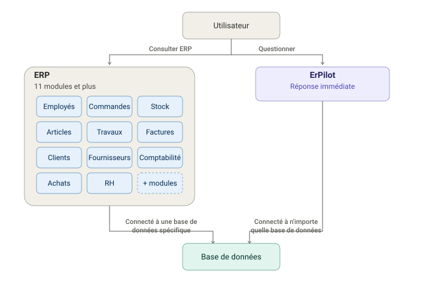
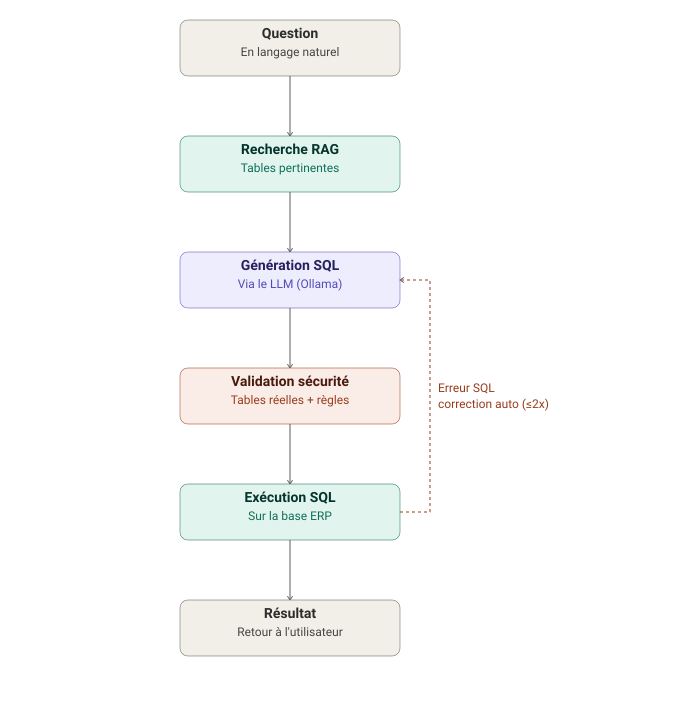
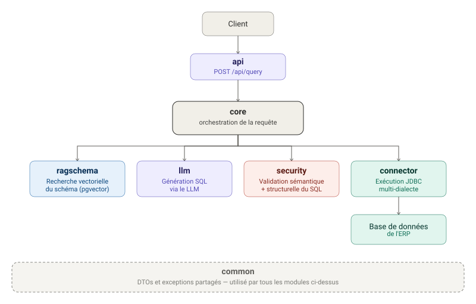

# ErPilot

🔓 **Projet open source**

**Interroge ton ERP en langage naturel — sans écrire une seule ligne de SQL.**

ErPilot est un **agent open source**, montable sur n'importe quel ERP, capable de répondre à n'importe quelle question posée sur les données de cet ERP — juste avec une question. Il se connecte à la base de données de l'ERP, comprend sa structure automatiquement (RAG sur le schéma), et transforme la question en langage naturel en une requête SQL exécutée en toute sécurité, avec correction automatique en cas d'erreur.

---

## 📌 Problématique

Plus un ERP grandit — beaucoup d'onglets, beaucoup de tables, beaucoup de lignes — plus il devient difficile d'en extraire une information précise sans :
- connaître en détail l'ERP, ses différents écrans et ses différents boutons,
- solliciter un(e) expert pour effectuer des actions avancées dans l'ERP,
- se contenter des rapports prédéfinis, souvent trop rigides pour suivre la complexité réelle des données.
  **ErPilot supprime cette barrière, quelle que soit la taille de l'ERP.** N'importe quel utilisateur métier pose sa question en français (ou dans une autre langue), et le système se charge de retrouver les bonnes tables au milieu de centaines d'autres, générer le SQL correspondant, l'exécuter, et retourner un résultat exploitable.

Deux façons de l'utiliser :
- **En agent connecté** : ErPilot se branche sur la base de données de l'ERP existant, sans rien modifier à l'application en place.
- **Intégré directement au projet** : ErPilot devient un module du projet ERP lui-même.
---


## ✨ Fonctionnalités

- **Texte → SQL** : génération de requêtes SQL à partir d'une question en langage naturel, via un LLM.
- **RAG sur le schéma de la base** : les tables/colonnes pertinentes sont retrouvées automatiquement par recherche vectorielle (pgvector) avant génération, plutôt que d'envoyer tout le schéma au LLM à chaque question — indispensable dès que l'ERP compte beaucoup de tables.
- **LLM local ou via API** : ErPilot fonctionne aussi bien avec **Ollama en local** (aucun appel externe, tout tourne sur ta propre machine) qu'avec une **API LLM externe** (OpenAI, etc.), selon que tu privilégies la confidentialité totale, la simplicité, ou la puissance d'un modèle hébergé.
- **Confidentialité par conception** : le LLM ne voit **jamais** tes données. Il ne reçoit que le *schéma* de la base — noms de tables et de colonnes, récupérés via le RAG — jamais les lignes, jamais les valeurs. Son seul rôle est de produire une requête SQL ; c'est cette requête qui est ensuite exécutée directement sur ta base de données, sans que le contenu de tes données ne transite par le modèle.
- **Auto-correction** : si le SQL généré échoue à l'exécution, ErPilot renvoie l'erreur au LLM et retente une génération corrigée automatiquement.
- **Sécurité SQL à deux niveaux** : la validation ne se limite pas à des règles sémantiques (lecture seule, mots-clés interdits...) — chaque requête générée est aussi vérifiée structurellement : les tables qu'elle référence doivent réellement exister dans le schéma de la base connectée, sinon la requête est rejetée avant exécution.
- **Connecteur multi-ERP** : architecture pensée pour se connecter à n'importe quelle base via JDBC, avec détection ou configuration explicite du dialecte SQL.
- **Gestion d'erreurs robuste** : le serveur ne plante jamais silencieusement — chaque erreur (LLM indisponible, SQL invalide, connexion perdue...) est capturée, loguée dans des fichiers dédiés, et renvoyée au client sous une forme exploitable avec un identifiant de traçabilité (`traceId`).
- **API REST** simple (`POST /api/query`) — utilisable depuis n'importe quel client (front web, script, terminal).
- **Terminal coloré** fourni pour tester et faire des démos rapidement, sans interface graphique.

---

## 💡 Exemple concret

> Un responsable commercial veut savoir : *« Quels sont les clients qui ont commandé plus de trois fois ce trimestre, mais dont le panier moyen a baissé par rapport au trimestre précédent ? »*
>
> Ce cas n'a jamais été prévu par les développeurs au moment de concevoir les rapports standards de l'ERP — aucun écran, aucun filtre prédéfini ne le couvre. Avec un ERP classique, il faudrait ouvrir un ticket et attendre qu'un développeur écrive une requête sur mesure.
>
> **Avec ErPilot, la question est posée telle quelle — et la requête SQL correspondante est générée et exécutée immédiatement.** Pas de ticket, pas d'attente : la limite des rapports figés de l'ERP devient invisible, et le point fort d'ErPilot apparaît clairement — répondre à des questions qu'on n'avait même pas imaginées.

---

## 🎥 Démonstration


---

## 🔌 Comment ErPilot s'intègre à un ERP



---

## ⚙️ Comment le système fonctionne



---

## 🏗️ Architecture du code



---

## 🚀 Installation et lancement

### 1. Prérequis

- Java (vérifie la version exacte dans `pom.xml`)
- Maven
- [Ollama](https://ollama.com) installé localement **— ou, si tu préfères, une clé API vers un LLM externe (OpenAI, etc.)**
- PostgreSQL (version supportant l'extension [`pgvector`](https://github.com/pgvector/pgvector))

### 2. Installer les modèles Ollama

Si tu choisis l'option locale, ErPilot utilise un modèle de langage pour générer le SQL, et un modèle d'embeddings pour la recherche vectorielle sur le schéma :

```bash
ollama pull llama3.1
ollama pull nomic-embed-text
```

Vérifie qu'Ollama tourne bien en arrière-plan (`ollama serve`, généralement lancé automatiquement après l'installation).

> Si tu préfères passer par une API externe plutôt que par Ollama en local, configure les propriétés `spring.ai.*` correspondantes dans `application.properties` à la place des propriétés Ollama ci-dessous.

### 3. Préparer la base PostgreSQL

Crée une base PostgreSQL et active l'extension `pgvector` (utilisée pour stocker et rechercher les embeddings du schéma) :

```sql
CREATE DATABASE erpilot;
\c erpilot
CREATE EXTENSION IF NOT EXISTS vector;
```

> Cette base peut être la même que celle de ton ERP (comme dans la démo), ou une base séparée dédiée uniquement au stockage des embeddings — les deux fonctionnent, tant que l'extension `vector` y est activée.

### 4. Configurer `application.properties`

Dans `src/main/resources/application.properties`, renseigne au minimum :

```properties
# Base de données applicative (stockage des embeddings du schéma via pgvector)
spring.datasource.url=jdbc:postgresql://localhost:5432/erpilot
spring.datasource.username=<ton_utilisateur>
spring.datasource.password=<ton_mot_de_passe>
spring.jpa.hibernate.ddl-auto=update

# Modèles Ollama
spring.ai.ollama.base-url=http://localhost:11434
spring.ai.ollama.chat.options.model=llama3.1
spring.ai.ollama.embedding.options.model=nomic-embed-text

# (Optionnel) connexion automatique à la base ERP cible au démarrage
erpilot.connection.url=jdbc:postgresql://localhost:5432/mon_erp
erpilot.connection.username=<utilisateur_erp>
erpilot.connection.password=<mot_de_passe_erp>
rag.schema.top-k=3
rag.schema.max-distance=0.8
```


### 5. Lancer l'application

```bash
mvn spring-boot:run
```

Le serveur démarre sur `http://localhost:8080` par défaut. Les logs sont écrits dans `logs/erpilot.log` (tous les logs) et `logs/erpilot-error.log` (erreurs graves uniquement), en plus de la console.

### 6. Utiliser ErPilot

**Option A — via l'API REST directement :**

```bash
curl -X POST http://localhost:8080/api/query \
  -H "Content-Type: application/json" \
  -d '{"question": "Quels sont mes 5 meilleurs clients ?", "role": "user"}'
```

**Option B — via le terminal coloré (recommandé pour tester/démo) :**

```bash
chmod +x erpilot-terminal.sh
./erpilot-terminal.sh
```

Le serveur doit être lancé (étape 5) avant de démarrer le terminal.

---

## 🗺️ Roadmap

- [ ] Support multi-dialecte complet (MySQL, Oracle, SQL Server)
- [ ] Développement d'un SDK (Java / Python / TypeScript) pour faciliter l'intégration d'ERPilot dans d'autres applications
- [ ] Interface web (frontend de chat)
- [ ] Documentation Swagger/OpenAPI intégrée

Les contributions sont les bienvenues — voir `CONTRIBUTING.md`.

---

## 📄 Licence

Ce projet est distribué sous licence [MIT](LICENSE) *(à adapter selon ton choix)*.
